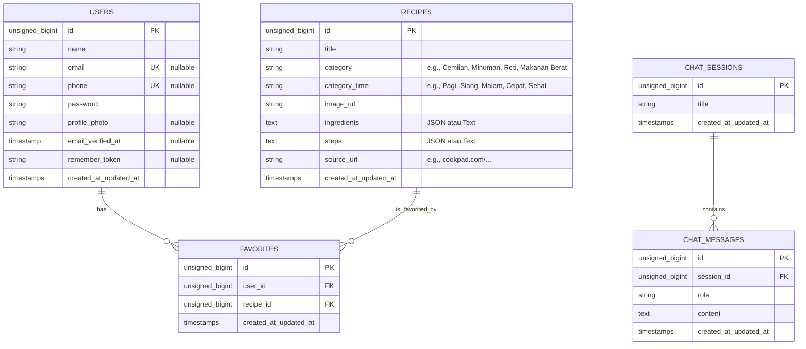

# Product Requirement Document (PRD)
## Project: Website Resep Kuliner Interaktif & AI (Laravel)

Dokumen ini mendefinisikan persyaratan fungsional, arsitektur database, antarmuka pengguna (UI), rute, dan rencana implementasi proyek resep masakan berbasis Laravel dengan integrasi AI.

---

## 1. Ikhtisar Produk (Product Overview)
Aplikasi ini adalah platform resep masakan modern yang membantu pengguna menemukan, mencari, menyimpan, dan berkonsultasi tentang resep menggunakan AI. Aplikasi ini dirancang dengan antarmuka yang sangat estetik menggunakan **Tailwind CSS v4** dan navigasi taskbar yang konsisten.

---

## 2. Fitur Utama & Persyaratan Fungsional

### Fitur 1: Autentikasi Pengguna (Login & Register)
*   **Deskripsi**: Sebelum masuk ke sistem utama, pengguna harus melakukan login/register.
*   **Persyaratan Login**:
    *   Pengguna dapat login menggunakan **Email** ATAU **Nomor HP** yang dikombinasikan dengan password.
    *   Tersedia validasi input untuk memastikan kredensial yang dimasukkan valid dan aman.
*   **Persyaratan Register**:
    *   Form registrasi mengumpulkan: Nama Lengkap, Email, Nomor HP, Password, dan Konfirmasi Password.
    *   Semua data disimpan ke tabel `users`.
*   **Keamanan & Alur**:
    *   Seluruh halaman utama (Dashboard, Pencarian, Tanya AI, Favorit, Akun) akan dilindungi oleh middleware `auth`.
    *   Pengguna yang belum terautentikasi akan diarahkan ke halaman login.

### Fitur 2: Dashboard Masakan
*   **Deskripsi**: Halaman utama setelah berhasil masuk yang berisi kategori, rekomendasi AI, dan display resep harian.
*   **Fitur Kategori**:
    *   Terdapat 5 kotak kategori visual yang estetik: **Pagi (Breakfast)**, **Siang (Lunch)**, **Malam (Dinner)**, **Cepat (Quick)**, dan **Sehat (Healthy)**.
*   **Rekomendasi AI**:
    *   Sebuah tombol khusus "Rekomendasi AI" diletakkan di bawah kategori.
    *   Ketika tombol ditekan, sistem mengirim kategori terpilih ke API AI (Groq) untuk memformulasikan saran menu masakan yang relevan dengan kategori tersebut secara interaktif.
*   **Display Resep Harian (Rekomendasi Hari Ini)**:
    *   Menampilkan grid resep-resep pilihan terbaik dari database.
    *   Menampilkan foto makanan, nama masakan, dan tag kategori.
    *   Jika salah satu resep ditekan, akan membuka halaman detail (atau modal detail) yang memuat:
        *   Foto masakan (ukuran besar).
        *   Tombol "Tambah/Hapus Favorit" di bagian atas detail.
        *   Daftar bahan-bahan (bullet points).
        *   Langkah-langkah pembuatan (numbered list).
        *   Sumber/Referensi di paling bawah yang berisi link eksternal (contoh: Cookpad).

### Fitur 3: Fitur Pencarian & Database Resep
*   **Deskripsi**: Pengguna dapat mencari resep masakan berdasarkan kata kunci nama masakan.
*   **Pencarian**:
    *   Input pencarian yang intuitif.
    *   Menampilkan hasil pencarian dalam bentuk grid resep (foto & nama).
    *   Mengklik hasil pencarian akan membuka detail resep dengan struktur yang sama seperti di Dashboard.
    *   Pencarian menggunakan pencocokan query string yang presisi terhadap kolom nama masakan.
*   **Kebutuhan Database & Seeder**:
    *   Tabel `recipes` berisi data resep lengkap (nama, kategori, gambar, bahan, langkah-langkah, dan sumber referensi).
    *   Menyediakan database seeder yang memuat **minimal 30 resep beraneka ragam**:
        *   **Cemilan** (min. 7 resep)
        *   **Minuman** (min. 7 resep)
        *   **Roti/Kue** (min. 7 resep)
        *   **Makanan Berat** (min. 9 resep)

### Fitur 4: Tanya AI (Koki AI)
*   **Deskripsi**: Integrasi dengan fitur AI yang sudah ada sebelumnya di dalam project.
*   **Persyaratan**:
    *   Fitur Chat/Tanya AI yang telah dikembangkan (`ChatController` dengan Groq API) dipertahankan dan dihubungkan ke dalam sistem tanpa merusak atau mengubah logika dasarnya.
    *   Tombol di taskbar/navbar akan mengarahkan pengguna ke halaman Koki AI ini (`/chat` atau `chat.index`).

### Fitur 5: Resep Favorit & Bookmark
*   **Deskripsi**: Pengguna dapat menandai resep tertentu sebagai favorit untuk disimpan dan dilihat kembali nanti.
*   **Persyaratan**:
    *   Tombol Favorit (misal: ikon hati ♥) ditempatkan secara mencolok di bagian atas halaman detail resep (di dashboard, hasil pencarian, maupun halaman favorit itu sendiri).
    *   Tombol berfungsi ganda (toggle): jika belum favorit, akan menambahkan ke daftar favorit; jika sudah favorit, akan menghapusnya.
    *   Tabel database `favorites` menyimpan relasi `user_id` dan `recipe_id`.
    *   Halaman Favorit menampilkan daftar resep yang telah di-bookmark dengan tampilan grid yang konsisten (gambar & nama).
    *   Tersedia tombol cepat "Hapus Favorit" untuk mengeluarkan resep dari halaman tersebut.

### Fitur 6: Akun & Manajemen Profil
*   **Deskripsi**: Halaman untuk melihat informasi pengguna dan memperbarui data profil.
*   **Persyaratan**:
    *   Menampilkan Foto Profil (menyediakan default avatar jika belum diunggah), Nama Lengkap, dan Kredensial Akun (Email/No HP).
    *   Fitur **Edit Profil**: Pengguna dapat mengubah nama lengkap mereka dan mengunggah/mengganti foto profil baru.
    *   Tombol **Logout** untuk keluar dari sistem dan menghancurkan sesi autentikasi.
    *   Setiap perubahan profil langsung disimpan ke tabel `users`.

### Navigasi: Taskbar / Menu Utama
*   **Deskripsi**: Menu navigasi yang diletakkan secara konsisten (disarankan di bagian bawah untuk tampilan mobile-friendly atau bagian atas sebagai navbar modern).
*   **Menu Terdiri dari**:
    1.  **Dashboard** (Menuju halaman dashboard masakan)
    2.  **Pencarian** (Menuju halaman pencarian resep)
    3.  **Tanya AI** (Menuju halaman chat AI yang sudah dikembangkan)
    4.  **Favorit** (Menuju daftar resep favorit pengguna)
    5.  **Akun** (Menuju halaman profil pengguna)
*   **Syarat**: Alur navigasi lancar, tidak ada link rusak, dan transisi antar halaman halus.

---

## 3. Arsitektur Database & Skema Tabel

---

## 4. Struktur Rute (Routes Map)

| URL | Nama Rute | Metode | Controller & Method | Deskripsi |
| :--- | :--- | :--- | :--- | :--- |
| `/login` | `login` | GET | `AuthController@showLogin` | Tampilan halaman login (Email/No HP) |
| `/login` | `login.submit` | POST | `AuthController@login` | Proses autentikasi masuk |
| `/register` | `register` | GET | `AuthController@showRegister` | Tampilan halaman registrasi |
| `/register` | `register.submit` | POST | `AuthController@register` | Proses pendaftaran akun baru |
| `/logout` | `logout` | POST | `AuthController@logout` | Proses logout pengguna |
| `/dashboard` | `dashboard` | GET | `DashboardController@index` | Dashboard utama resep |
| `/dashboard/ai-recommend` | `dashboard.ai` | GET | `DashboardController@aiRecommend` | Meminta rekomendasi AI untuk kategori tertentu |
| `/recipes/{recipe}` | `recipes.show` | GET | `RecipeController@show` | Detail resep (Bahan, Langkah, Referensi) |
| `/search` | `search` | GET | `RecipeController@search` | Tampilan pencarian & hasil pencarian |
| `/chat` | `chat.index` | GET | `ChatController@index` | Halaman Tanya AI (Existing) |
| `/chat` | `chat.submit` | POST | `ChatController@chat` | Proses submit pesan ke AI (Existing) |
| `/favorites` | `favorites.index` | GET | `FavoriteController@index` | Daftar resep favorit pengguna |
| `/favorites/toggle/{recipe}` | `favorites.toggle` | POST | `FavoriteController@toggle` | Toggle add/remove dari favorit |
| `/profile` | `profile.index` | GET | `ProfileController@index` | Halaman kelola profil & akun |
| `/profile/update` | `profile.update` | POST | `ProfileController@update` | Proses update nama & foto profil |

---

## 5. Rencana Seeder Resep (30+ Resep)
1.  **Cemilan (Snack)**: Bakwan Sayur, Cireng Rujak, Tempe Mendoan, Pisang Goreng Pasir, Jasuke, Cilok Bumbu Kacang, Batagor Bandung.
2.  **Minuman (Drink)**: Es Teh Manis Lemon, Es Teler Kelapa Muda, Jus Alpukat Kocok, Wedang Jahe Susu, Es Cappuccino Cincau, Matcha Latte, Es Kuwut Bali.
3.  **Roti & Kue (Bread & Cakes)**: Martabak Manis mini, Brownies Kukus Cokelat, Bolu Panggang Pandan, Roti Bakar Bandung, Roti Sobek Kasur, Klepon Gula Merah, Kue Lumpur Kentang.
4.  **Makanan Berat (Heavy Meals)**: Nasi Goreng Kampung, Rendang Daging Sapi, Ayam Goreng Lengkuas, Sate Ayam Madura, Soto Ayam Lamongan, Gado-Gado Betawi, Bakso Sapi Kuah, Capcay Kuah Sayur, Mie Goreng Jawa.

---

## 6. Desain Visual & Estetika (UI/UX)
*   **Tema Warna**: Nuansa modern pastel dengan warna dasar hijau mint segar (`#10B981`) dan oranye hangat (`#F59E0B`) untuk merepresentasikan kesegaran kuliner.
*   **Tata Letak**: Desain responsif, mobile-first, dengan navigasi taskbar yang melayang (floating bottom navigation) di layar kecil dan sidebar/header modern di desktop.
*   **Interaktivitas**: Hover effect halus pada card resep, micro-animations pada klik favorit (hati yang berdenyut), dan transisi dinamis saat memencet kategori.
